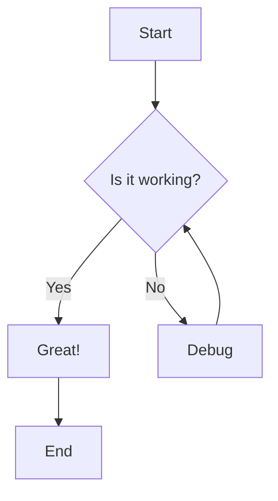

# Mermaid Render

A web-based Mermaid diagram editor with real-time preview and image export capabilities. Build beautiful diagrams and export them as PNG or JPG images.

## Features

- **Real-time Preview**: See your diagrams update instantly as you type
- **Monaco Editor**: VS Code-style code editing with syntax highlighting
- **Image Export**: Export diagrams as high-quality PNG or JPG images
- **Local Storage**: Your code is automatically saved and restored
- **Responsive Design**: Works on desktop and mobile devices
- **Dark Theme**: Easy on the eyes for extended use

## Getting Started

### Prerequisites

- Node.js 20 or higher
- npm or yarn

### Installation

```bash
# Clone the repository
git clone https://github.com/yanjunzhu/mermaid-render.git

# Navigate to the project directory
cd mermaid-render

# Install dependencies
npm install
```

### Development

```bash
# Start development server
npm run dev
```

The application will open at `http://localhost:3000`.

### Build

```bash
# Build for production
npm run build

# Preview production build
npm run preview
```

## Usage

1. **Write Mermaid Code**: Use the editor on the left to write your Mermaid diagram code
2. **Preview**: The right panel shows a real-time preview of your diagram
3. **Export**: Click "Export PNG" or "Export JPG" to download your diagram

### Example Mermaid Code



## Tech Stack

| Technology | Purpose |
|------------|---------|
| [Preact](https://preactjs.com/) | UI Framework |
| [Vite](https://vitejs.dev/) | Build Tool |
| [Mermaid](https://mermaid.js.org/) | Diagram Rendering |
| [Monaco Editor](https://microsoft.github.io/monaco-editor/) | Code Editor |
| [html-to-image](https://github.com/bubkoo/html-to-image) | Image Export |

## Scripts

| Command | Description |
|---------|-------------|
| `npm run dev` | Start development server |
| `npm run build` | Build for production |
| `npm run preview` | Preview production build |
| `npm run lint` | Run ESLint |
| `npm run lint:fix` | Fix ESLint errors |
| `npm run type-check` | Run TypeScript type checking |
| `npm run format` | Format code with Prettier |

## Contributing

See [CONTRIBUTING.md](./CONTRIBUTING.md) for guidelines.

## License

[MIT](./LICENSE)
